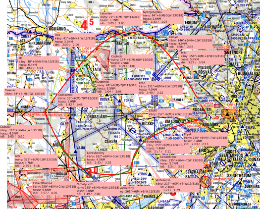

# VFR Function Routes

## Why?

This app is for pilots. For pilots who are tired of going the straight routes.

The idea is not mine but when I heard that we could fly following mathematically defined curves, the idea stuck with me. It fascinated me on so many levels. I, as a pilot (which is a hobby for me) was fascinated by how we can plan and how we can fly this visually without technical aids. As a programmer (again just a hobby) I saw an opportunity to create an app to make it easy to plan. As someone who uses math for daily work, I tried to find the way to calculate this.

So this app is a route planner, for non-straight lines.

## How?

Just go to the website, start a route (new, load or use the sample). Then go through the steps. You will define an area where you want to fly, then the waypoints, then math functions, their x-values at different points and additional constraining points if needed. Then you can add annotations at certain points which will aid you in following the changes in the curve more easily while flying. And when you get out of the plane after your flight, you can add your actual flown path to compare.

## What?

This is just a webapp now I spun up as a hobby project. Use it and enjoy. If you like it, buy me a beer/coffee when we meet at an airport.